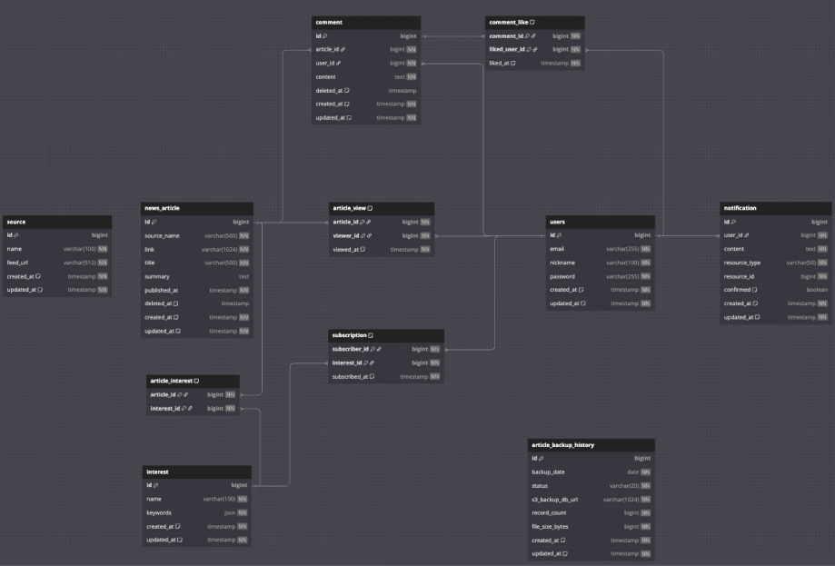

# News-For-EveryOne
## 📌 프로젝트 소개

-  여러 뉴스 API를 통합하여 사용자에게 맞춤형 뉴스를 제공하고, 의견을 나눌 수 있는 소셜 기능을 갖춘 서비스입니다.

### 📌 프로젝트 정보

| 항목 | 내용             |
|------|----------------|
| **📆 프로젝트 기간** | 2025.05.28 ~ 2025.06.18 |
| **🔗 배포 링크** | [모두의 뉴스, 모뉴](http://sprint-project-1196140422.ap-northeast-2.elb.amazonaws.com/sb/monew/login) |
| **📋 협업 문서** | [Notion 페이지](https://nebula-shoulder-dc6.notion.site/200016a491728087ace2e0feb7e4a740?v=200016a49172807fb4be000c53305ab6) |
| **📘 API 문서** | [Swagger 문서](http://sprint-project-1196140422.ap-northeast-2.elb.amazonaws.com/sb/monew/api/swagger-ui/index.html) |

## 🏃‍♀️ 프로젝트 구성원과 R&R

| 이름        | 역할 및 기여                   |
|-----------|---------------------------|
| [황지환(팀장)] |  |
| [김보경](https://github.com/BokyungKim-SPRING)     | • 사용자 관리 도메인 설계 및 기능 구현  • Spring Security를 통한 세션 인증 구현  • Comment / CommentLike 도메인 설계 및 기능 구현 • 댓글 목록 커서 페이지네이션 구현  |
| [한상엽]     | 	• 뉴스 기사 수집 도메인 설계 및 기능 구현  • Spring Batch 기반 Naver Open API 및 RSS 기사 수집 구현   • 뉴스 기사 백업 및 복구 기능 개발 (AWS S3 연동) |
| [강지훈](https://github.com/homeA90)     |  • 뉴스 기사 수집 도메인 설계 및 기능 구현  • Spring Batch 기반 Naver Open API 및 RSS 기사 수집 구현   • 뉴스 기사 백업 및 복구 기능 개발 (AWS S3 연동)   • CI/CD 파이프라인 구축 |
| [윤영로]     |  • 뉴스 기사 수집 도메인 설계 및 기능 구현  • Spring Batch 기반 Naver Open API 및 RSS 기사 수집 구현   • 뉴스 사 백업 및 복구 기능 개발 (AWS S3 연동) |

## 🏫 주요 기능

### 사용자 관리
- 회원가입, 로그인, 닉네임 수정 기능
- 논리적 삭제 지원으로 데이터 무결성 유지
- Spring Security를 통한 인증 검사
- securityFilterChain을 통한 허용 경로 제한

### 관심사 관리

### 뉴스 기사 관리
- Naver: Open API, 한국경제, 조선일보, 연합뉴스: RSS Feed 기반 수집
- Spring Batch를 이용하여 Chunk 단위 처리로 대용량 데이터 효율적으로 수집
- 정렬 및 커서 페이지네이션을 이용한 검색 및 조회 기능
- 뉴스 백업 및 복구 기능
  
### 댓글 관리
- 기사별 댓글 등록, 수정, 삭제
- 댓글 좋아요 등록 및 취소
- 최신순 정렬 커서 기반 페이지네이션
- 댓글 작성/수정/삭제 시 사용자 활동 내역과 연동

### 활동 내역 관리

### 알림 관리

### 🫙 ERD

## 🛠️ 기술 스택

### 백엔드

### 데이터베이스

### 클라우드/인프라

### 테스트

### 협업

### 부하테스트

